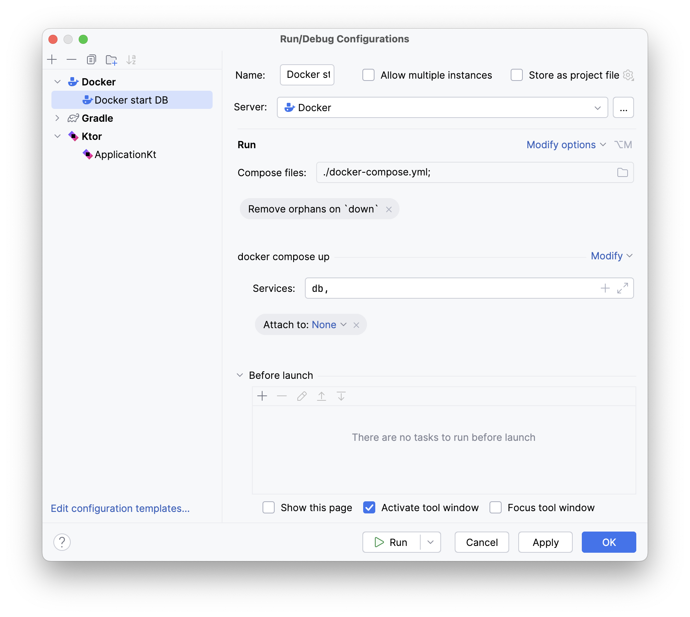
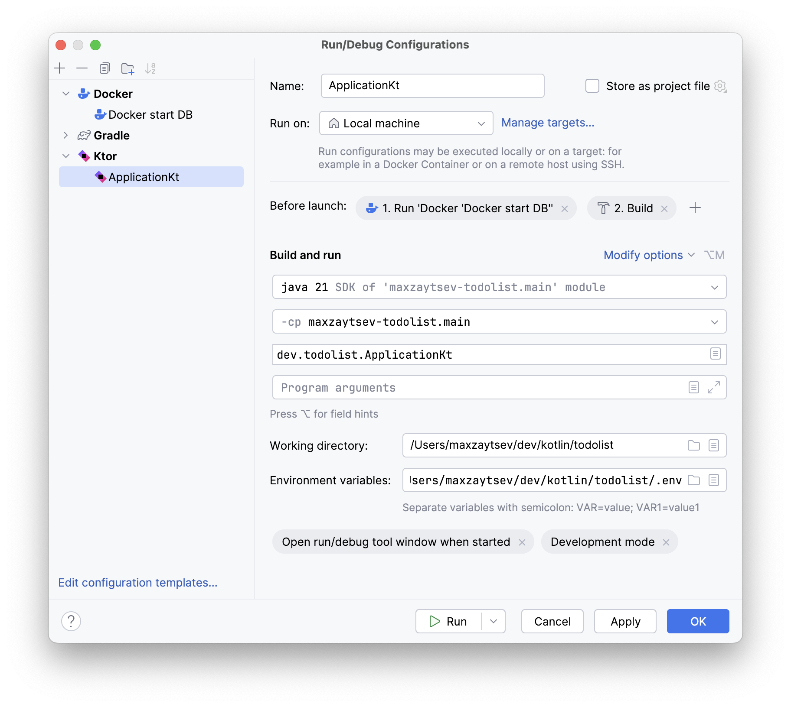

If you are using IntelliJ IDEA, you can run the app by pressing the green play button.
Make sure you have the Ktor plugin installed. In this case, your IDE will look something like this:

To make it work, you need to do two things:
- Make it use your `.env` variables
- Make use the DB is up and running

#### Make it use your `.env` variables
To do that, go to the `Run/Debug Configurations`, find your app configuration there (we assume it is called "ApplicationKt").
Then find the "Environment variables": section there and put there the path to your `.env` file.

#### Make use the DB is up and running
The easiest way to do that is to add a "Before launch" task to your run configuration.
To do that, you need to create a new task in your run configuration:
- Go to "Edit configurations" and then press the "+" button
- Select "Docker", then "Docker compose"
- Specify the path to your `docker-compose.yml` file and in the "Services" field put in `db`
  
- Once that configuration is added, you should get back to editing your "main" configuration.
- Now, in the "Before launch" section, add a new task and select that "Docker compose" configuration that you just created. Put it BEFORE the "Build" task, so the database is up and running before the app is built.
  